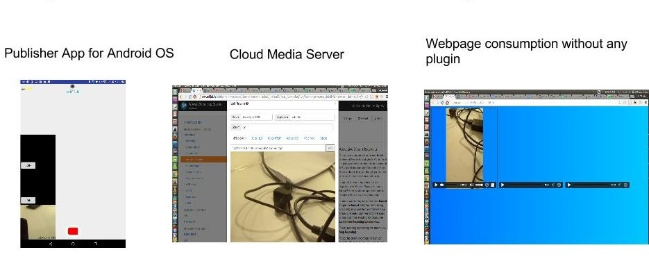
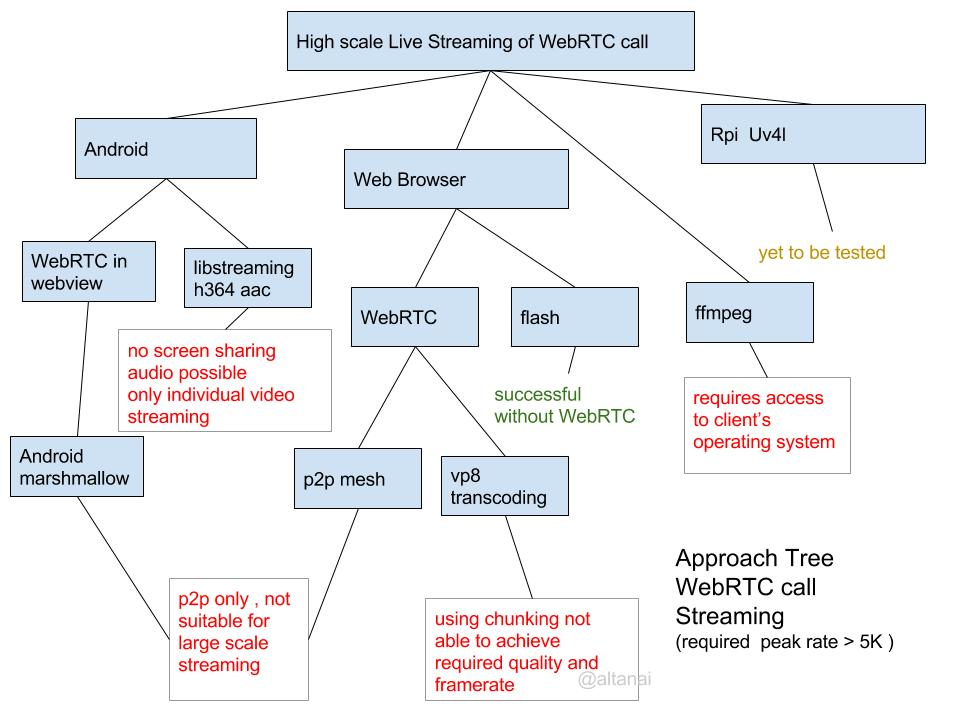
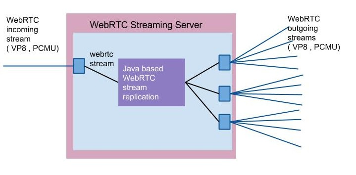
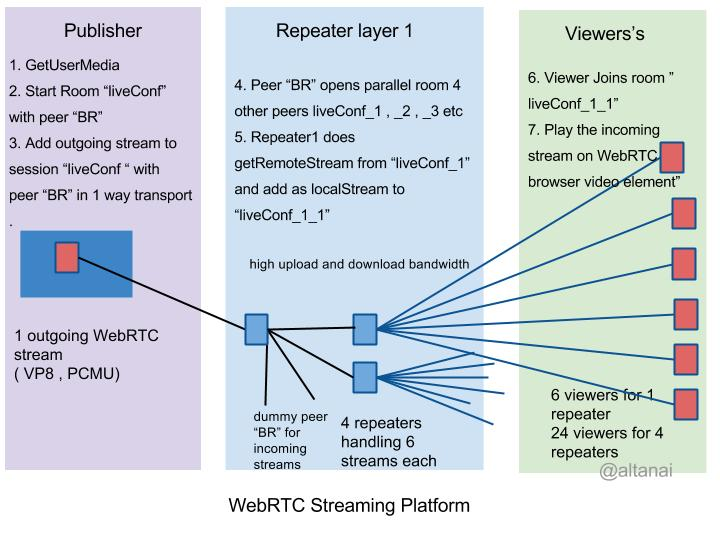

## WebRTC Scalable Streaming Server

### Aim :
 
To build a career grade WebRTC stream broadcasting platform , which is capable of using the 
WebRTC’s mediastream and peerconnection API , along with repeaters to make a scalable 
broadcasting / live streaming solution using socketio for behaviour control and signalling .  

Algorithm :
 
At the Publisher's end
 
1. GetUserMedia 

2. Start Room “liveConf” 

3. Add outgoing stream to session “liveConf “ with peer “BR” in 1 way transport . 
    1 outgoing audio stream ­> 1 MB in 1 RTP port  
    1 outgoing video ­> 1 MB  1 more RTP port 
Total Required 2 MB and 2 RTP ports  
 
At the Repeater layer (high upload and download bandwidth )
 
4. Peer “BR” opens parallel room “liveConf_1” , “liveConf_2” with 4 other peers “Repeater1 “, 
“Repeater2” , so on  

5. Repetare1 getRemoteStream from “liveConf_1” and add as localStream to “liveConf_1_1” 
 
Here the upload bandwidth is high and each repeater is capable of handling 6 outgoing streams 
. Therefore total 4 repeaters can handle upto 24 streams very easily 
 
 
At the Viewer's end
 
6. Viewer Joins room ”liveConf_1_1” 

7. Play the incoming stream on WebRTC browser video element”  
 
As 6 viewers can connect to 1 repeater for feed , total of  24 viewers will require only 4  repeaters. 
Only 2 MB consumption at publishers end and 2MB at each viewer's end. 

Live stream from ioS / Android publisher on RTSP

WebRTC Live streaming broadcasting Architecture 

Live stream 

  